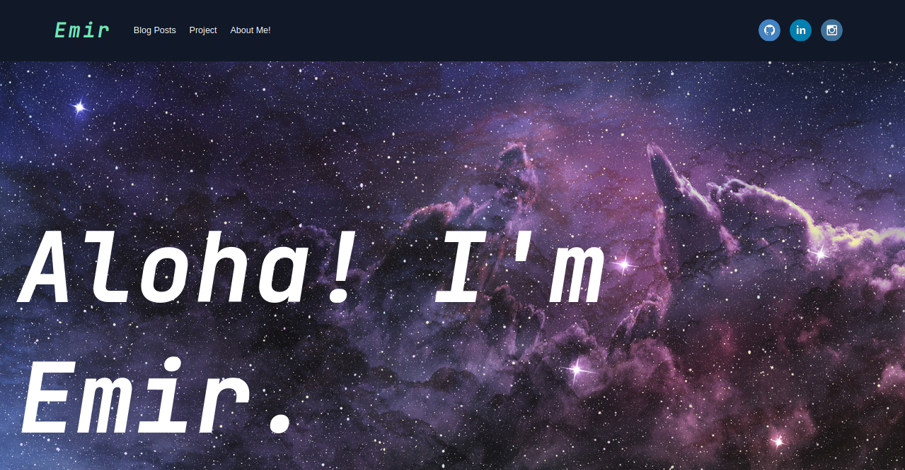

# Getting Started with Create React App

To see the final version of the portfolio: https://reactsanityportfolio.netlify.app/

## Getting Started

## Available Scripts

#### You should add your sanity project ID in client.js file
In the project directory, you can run:

### `npm start`

In the project directory, you can run:

### `cd studio`

And then:

### `sanity start`

Runs the app in the development mode.\
Open [http://localhost:3000](http://localhost:3000) to view it in the browser.

The page will reload if you make edits.\
You will also see any lint errors in the console.
